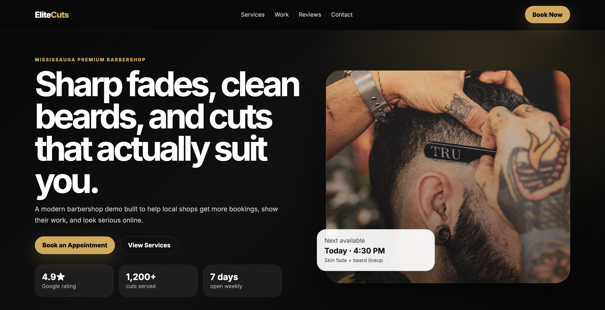
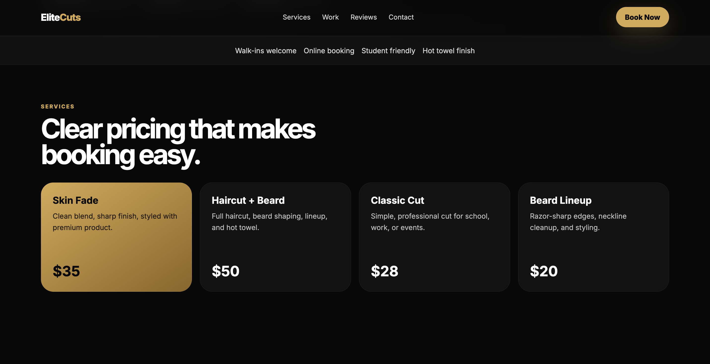
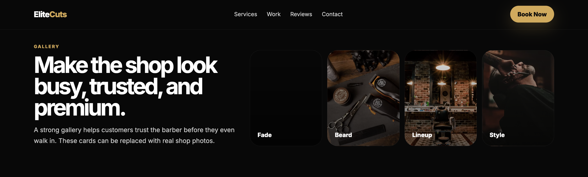
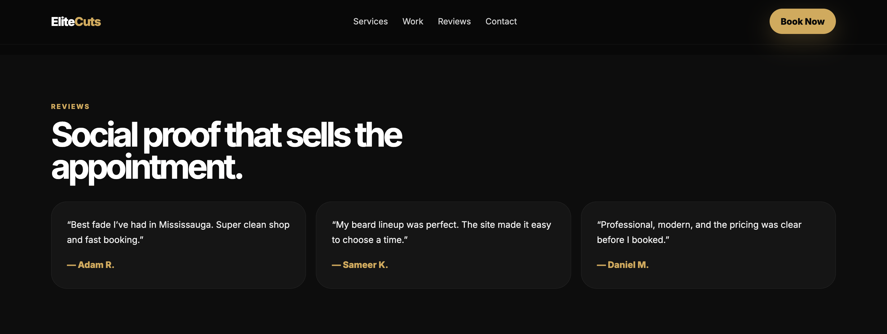
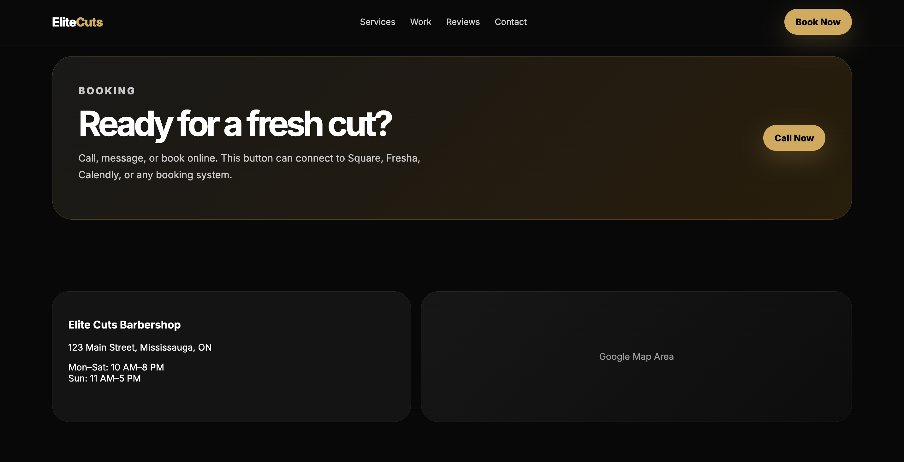

# 💈 Elite Cuts Barbershop

A premium, modern, and fully responsive barbershop website built to demonstrate the type of high-quality websites I create for local businesses.

Designed with a clean user experience, bold typography, modern layouts, and a mobile-first approach to help businesses build trust, attract new customers, and increase bookings.

---

## 🌐 Live Demo

🔗 **https://elite-cuts-demo.netlify.app**

---

## 📸 Preview

### Homepage



### Services Section



### Gallery Section



### Reviews Section



### Booking Section



---

## ✨ Features

- 📱 Fully responsive design
- 💈 Premium hero section
- 🎨 Modern UI/UX
- 💳 Services & pricing section
- 🖼️ Image gallery
- ⭐ Customer testimonials
- 📍 Contact & business information
- 📅 Call-to-action booking sections
- ⚡ Fast-loading static website
- 🧩 Clean and organized code

---

## 🛠️ Built With

- HTML5
- CSS3
- Vanilla JavaScript

---

## 🎯 Project Purpose

Elite Cuts was created as a portfolio project to showcase a modern website for barbershops and grooming businesses.

The goal is to demonstrate how a clean, professional website can:

- Build customer trust
- Showcase services
- Increase online bookings
- Improve mobile experience
- Strengthen a business's online presence

---

## 📂 Project Structure

```text
elite-cuts-demo/
│
├── index.html
├── style.css
├── README.md
│
└── images/
    ├── homepage-desktop.png
    ├── homepage-mobile.png
    ├── services.png
    ├── gallery.png
    └── reviews.png
```

---

## 🚀 Future Improvements

- Online appointment booking
- Google Maps integration
- Google Reviews integration
- Scroll animations
- Dark/Light mode
- SEO optimization
- Accessibility improvements
- Performance optimization
- CMS integration for business owners

---

## 📄 License

This project was created for portfolio and demonstration purposes.

Please do not copy, redistribute, or sell this project without permission.
